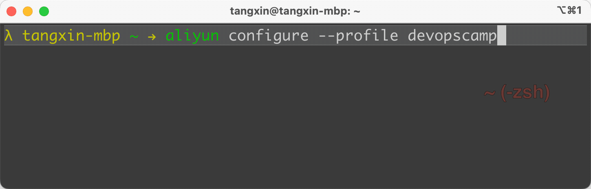

# 作业: cobra - 03 交互式命令

要求:

1. 使用 https://github.com/spf13/cobra 实现命令工具
2. 使用 https://github.com/go-survey/survey 实现交互式命令

3. 实现 Demo 效果

除了官方效果之外， 我还发现了 `aliyun` 命令行工具在配置账户的时候使用的是 **交互式** ， 如下

为了更好的体现 **实战性**， 我们将以 `aliyun configure --profile` 的作为例子， 并进行一些优化。

## 参考答案

独立完成以后或无法完成的时候， 可以参考答案

> https://tangx.in/posts/2023/01/26/devopscamp-cobra-interactive-survey/ 
