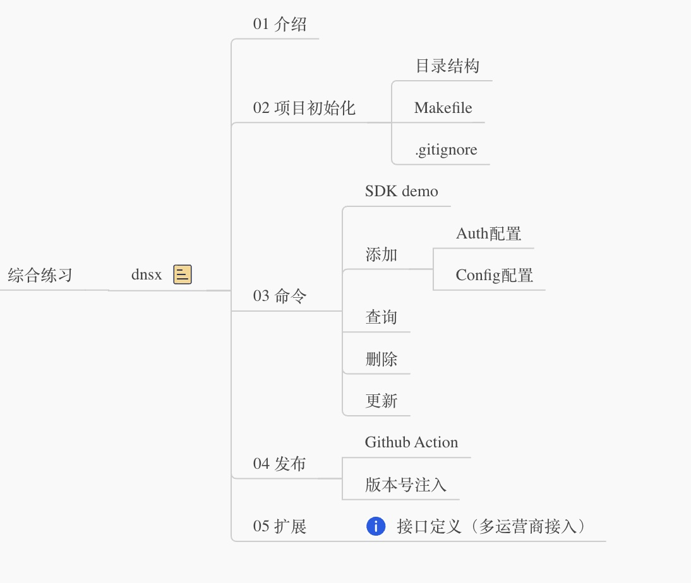

# Cobra 综合实战练习： 实现一个命令行的 dns 客户端

时间不知不觉到了 3 月， 我们的 DevOpsCamp 也到了 **第4期**。 在前面的内容中， 我尝试通过将 cobra 拆解成一个个功能， 并进行解释和扩展。 希望能带领大家逐步进入 Go 开发的世界。

其实这些都不难， 但是由于刚接触到一个未知的东西的时候， 总是有一种茫然无措， 不知道如何下手的烦躁和不安。 这个也是我当初入门的时遇到的困境。

希望大家在完成了这部分练习之后， 能自信的回过头来说一句 **原来不过如此嘛**。

## 本期练习

本期我们只做一个事情， 用 cobra 写一个 **命令行** 的 dns 客户端。把我们之前已经掌握了一些基本招式， 运用起来， 形成自己的拳法。

整个脑图，我整理如下。 没有思路的朋友可以根据这个脑图进行。 

在脑图中， **05 扩展** 中有一个 **接口定义**。 最终我们要实现多运营商截图。 因此在前期设计和实现的时候， 可以多考虑一下 **扩展性** 的问题。

**补充：** 本次 dns 解析上， 我用的是 dnspod， 也就是腾讯云。 选择其他大厂也一样， 都有完整的 SDK。

## 参考

1. 这里有一个很久之前练习写的 [tangx/dnsx - Github](https://github.com/tangx/dnsx) ， 权当参考。
2. 之前几期 cobra 的内容解题思路， 我都放到了这里 [Cobra 入门与实战](https://typonotes.com/books/golang/cobra-in-action/01-cobra-sample/) ， 方便回顾。

